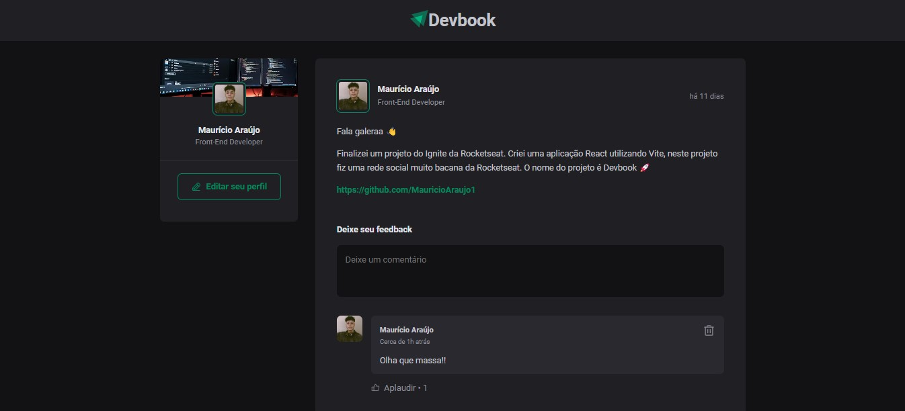

  

<h1 align="center">Social DevBook</h1>

Um projeto de uma rede social criado para interação de desenvolvedores com publicações, comentários e likes.

# 🎉 Sobre a DevBook
- Uma aplicação web destinada a criar posts e comentários com validações podendo remover-los e curtir a qualquer momento.

  

# ⚙️ Instalação
- Primeiramente você precisar criar um clone do repositório na sua máquina e depois abrir no vscode, logo após ter aberto o clone dentro da IDE Vscode, basta abrir o terminal e escrever o seguinte comando: "npm run dev" para criar um localhost com a tecnologia Vite.js, depois disso basta clicar no ip com as teclas: "Ctrl + Click" e você já irá ser redirecionado para a página da aplicação web. Caso não funcione, apenas instale as dependências com o comando: "npm i", e logo depois executar que irá funcionar normalmente.

# 🍸 Componentes utilizados
- Header
- Sidebar
- Avatar
- Post
- Comment

# 🧪 Tecnologias utilizadas
- HTML;
- CSS;
- JavaScript;
- TypeScript;
- React;
- Tailwind;
- Vite;
